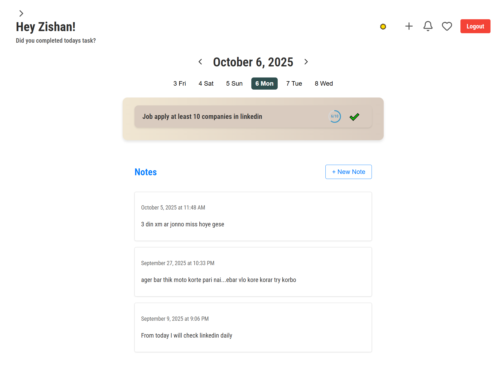

# Khalilur Rahman - Portfolio

A modern, responsive portfolio website showcasing my skills and projects as a full-stack developer. Built with React and Vite, featuring a clean design with dark/light theme toggle, smooth animations, and interactive elements.



## 🚀 Features

- **Responsive Design**: Optimized for all devices and screen sizes
- **Dark/Light Theme**: Toggle between themes with smooth transitions
- **Interactive UI**: Hover effects, animations, and smooth scrolling
- **Single Page Application**: Fast navigation with React Router
- **Contact Form**: Functional contact form with toast notifications
- **Project Showcase**: Featured projects with live demos and GitHub links
- **Skills Section**: Categorized skills with progress bars
- **Star Background**: Animated star field background effect

## 🛠️ Technologies Used

### Frontend

- **React 19** - Modern React with hooks and concurrent features
- **Vite** - Fast build tool and development server
- **Tailwind CSS** - Utility-first CSS framework
- **Lucide React** - Beautiful icon library
- **React Router DOM** - Client-side routing
- **React Hot Toast** - Toast notifications

### UI Components & Styling

- **Radix UI** - Accessible component primitives
- **Class Variance Authority** - Component variant management
- **Tailwind Merge** - Conditional class merging
- **clsx** - Conditional class names

### Development Tools

- **ESLint** - Code linting
- **Vite Plugin React** - React integration for Vite

## 📦 Installation

1. Clone the repository:

```bash
git clone https://github.com/Zishan976/react-portfolio.git
cd react-portfolio
```

2. Install dependencies:

```bash
npm install
```

3. Start the development server:

```bash
npm run dev
```

4. Open [http://localhost:5173](http://localhost:5173) in your browser.

## 🏗️ Build & Deployment

Build for production:

```bash
npm run build
```

Preview the production build:

```bash
npm run preview
```

## 📁 Project Structure

```
src/
├── components/
│   ├── AboutSaction.jsx      # About section
│   ├── ContactSection.jsx    # Contact form and info
│   ├── Footer.jsx           # Site footer
│   ├── HeroSection.jsx      # Hero/landing section
│   ├── Navbar.jsx           # Navigation bar
│   ├── ProjectSection.jsx   # Projects showcase
│   ├── SkillsSection.jsx    # Skills with categories
│   ├── StarBackground.jsx   # Animated background
│   └── ThemeToggle.jsx      # Theme switcher
├── pages/
│   ├── Home.jsx             # Main page
│   └── NotFound.jsx         # 404 page
├── lib/
│   └── utils.js             # Utility functions
├── App.jsx                  # Main app component
├── index.css                # Global styles
└── main.jsx                 # App entry point
```

## 🌟 Featured Projects

### HABITTO

A habit tracking web application to help users build and maintain good habits through tracking and analytics.

- **Tech Stack**: React, Node.js, Express, PostgreSQL
- **Live Demo**: [https://habitto.onrender.com/](https://habitto.onrender.com/)
- **GitHub**: [https://github.com/Zishan976/Habit-Tracker-Website](https://github.com/Zishan976/Habit-Tracker-Website)

### To-Do List Application

A task management app with email reminder features for upcoming deadlines.

- **Tech Stack**: EJS, Node.js, PostgreSQL, Express
- **Live Demo**: [https://to-do-list-app-5fbw.onrender.com/](https://to-do-list-app-5fbw.onrender.com/)
- **GitHub**: [https://github.com/Zishan976/To-Do-List-App](https://github.com/Zishan976/To-Do-List-App)

### Zflix

A social media web application for connecting, sharing content, and interacting with others.

- **Tech Stack**: React, React Router, API
- **Live Demo**: [https://zflix.onrender.com](https://zflix.onrender.com)
- **GitHub**: [https://github.com/Zishan976/Zflix](https://github.com/Zishan976/Zflix)

## 📞 Contact Information

- **Email**: sharkarzishan@gmail.com
- **Phone**: +8801796357683
- **Location**: Dhaka, Bangladesh
- **LinkedIn**: [khalilurrahmanzishan](https://www.linkedin.com/in/khalilurrahmanzishan/)
- **Facebook**: [k.r.zishan.17](https://www.facebook.com/k.r.zishan.17/)
- **Instagram**: [k.r.zishan](https://www.instagram.com/k.r.zishan/)

## 📄 License

This project is open source and available under the [MIT License](LICENSE).

---

Built with ❤️ by Khalilur Rahman
